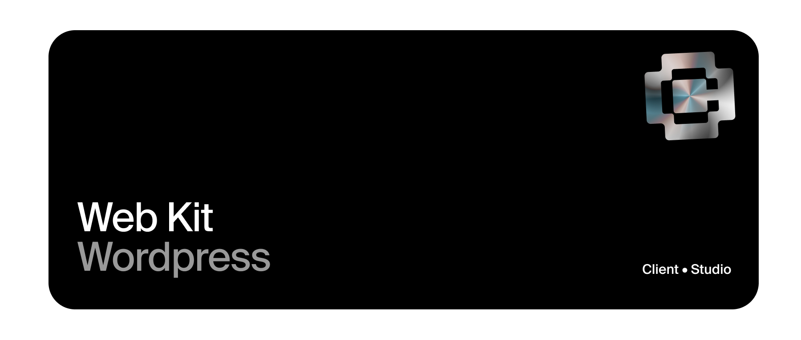

# Client Web Kit (Free) | Wordpress Starter template 

High-performance Wordpress Theme powered by Tailwind CSS 

npm install | npm run watch | npm run production
 
* Modular Content Blocks (/template-parts/)
* PageSpeed score 100/100

Demo site http://clientstart.wpengine.com/

## Developer docs

Find our developer docs here 

https://client.style →

## Requirements 

ACF PRO: Modular content blocks are created with ACF Flexible Fields that makes content blocks easy to edit, move and copy. 

GSAP: Some animations are powered by GSAP animations (menus). Expanded theme has multiple block elements that require GSAP Business.

## Design files 

Follow and get our Web Kit Block Figma here

https://www.figma.com/@clientstudio

## Notes

For a faster start, use our Blueprint templates inside Local or request access. 

* WP Functions (Snippets plugin)
* Admin Customisation
* Default Plugin Stack
* Library of ACF blocks
* Image Optimisation
* SEO / Caching / Security Setup

## Credits

Made by http://client.studio/

Based on Tailpress theme https://github.com/jeffreyvr/tailpress

